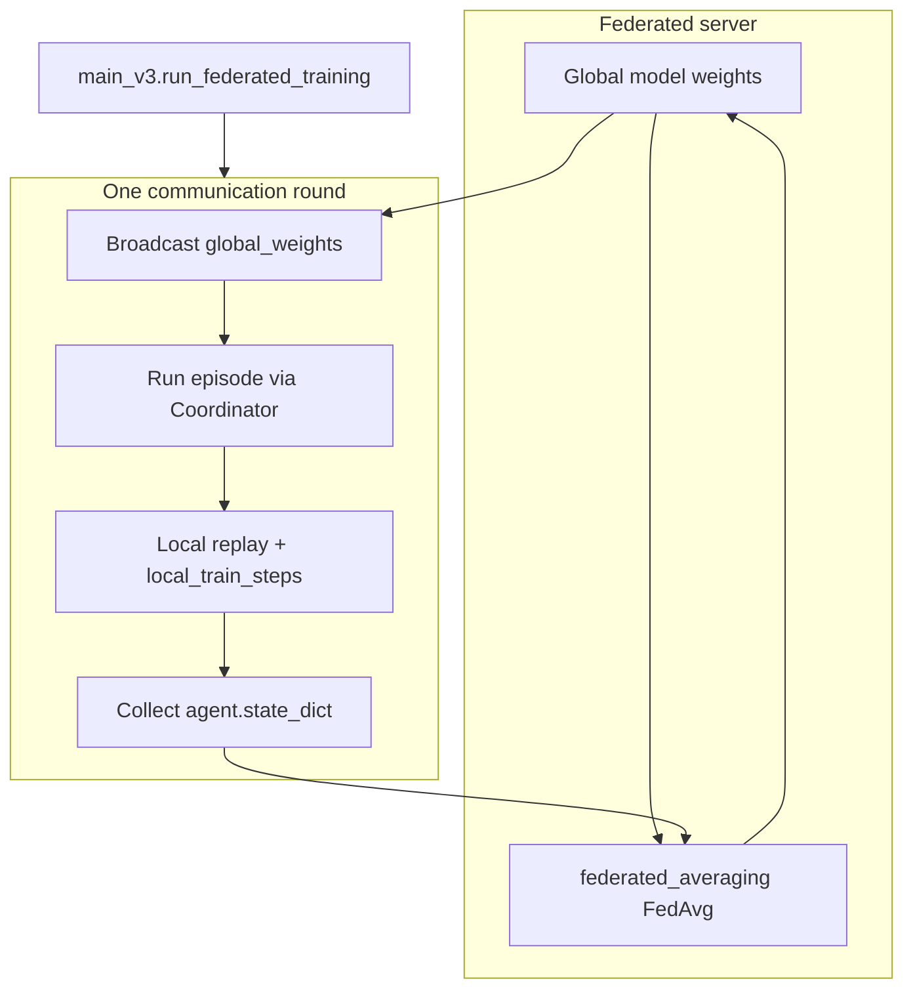
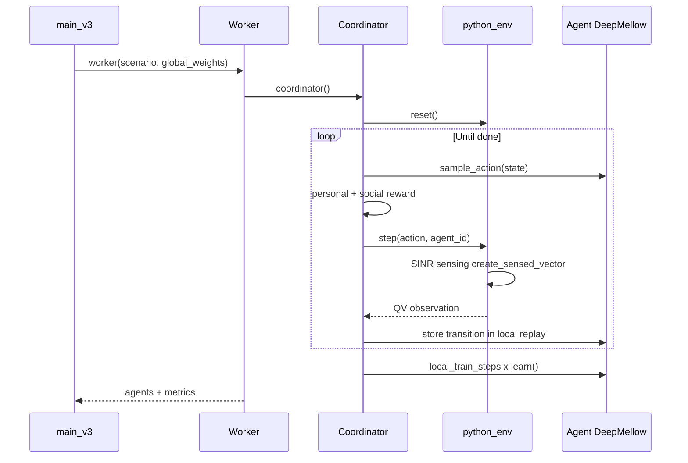
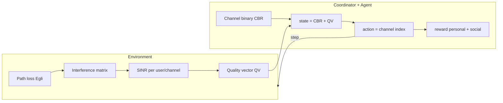

# Federated CARLTON Channel Allocation

PyTorch implementation of **CARLTON** (*Channel Allocation RL To Overlapped Networks*) from:

> **SINR-Aware Deep Reinforcement Learning for Distributed Dynamic Channel Allocation in Cognitive Interference Networks**  
> Yaniv Cohen, Tomer Gafni, Ronen Greenberg, Kobi Cohen — [arXiv:2402.17773](https://arxiv.org/abs/2402.17773)

This repository simulates overlapping cognitive networks, senses channel quality from SINR, and trains network managers with **DeepMellow Q-learning** in a **Federated Reinforcement Learning (FRL)** loop: each agent keeps a **local replay buffer**, trains locally, uploads weights, and the server applies **FedAvg**.

---

## High-level idea

| Concept | In the paper | In this code |
|--------|----------------|--------------|
| Agent | Network manager | `Agent` + `DeepMellow` |
| Observation | Quality vector **QV** + channel bits **CBR** | `create_sensed_vector` → `modify_obs_add_channnel_2b` |
| Action | Pick one frequency channel | `python_env.step(action)` |
| Reward | Personal + social welfare | `calculate_rewards_personal` + `calculate_rewards_sw` |
| Training | CTDE + global replay (paper) | **FRL**: local replay + `federated_averaging` |

---

## Federated training flow



**Per communication round:**

1. Sample a random scenario (`python_env` + network layout).
2. **Broadcast** current global weights to every network manager agent.
3. **Decentralized execution**: agents take turns choosing channels; environment computes SINR-based QV; coordinator assigns rewards.
4. **Local training**: each agent updates its PyTorch model from its **private** replay buffer.
5. **Upload** local `state_dict()` tensors.
6. **FedAvg** → new global weights for the next round.

---

## Episode flow (single scenario)



---

## Repository structure

```
fed-channel-alloc/
├── main_v3.py                 # Federated training entry point
├── test_federated_run.py      # 2-round sanity check
├── requirements.txt
│
├── BuildingBlocks/
│   ├── Worker.py              # Thin wrapper → coordinator
│   ├── Coordinator.py         # Multi-agent episode loop, rewards, local replay
│   ├── Agent.py               # Agent API: act, learn, state_dict
│   └── TrainBlock.py          # federated_averaging, broadcast helpers
│
├── DeepMellow_Single_agent/
│   ├── DeepMellow_no_epsilon.py  # PyTorch DeepMellow + QResNet (active learner)
│   ├── ReplayMemory.py           # Circular local experience buffer
│   ├── DeepMellow.py             # Legacy TensorFlow variant (not used by main_v3)
│   └── Nets_keras.py             # Legacy Keras nets (not used by main_v3)
│
├── SimulationEnvironments/
│   ├── Pythonic_Environment.py   # Wireless env: SINR, step/reset, turn-taking
│   ├── Egli.py                   # Path loss & spectral attenuation (Table I)
│   ├── Env_Utiles.py             # dBm / Watt conversions
│   └── test_env.py               # Small environment smoke test
│
├── Utils/
│   ├── utils.py                  # creat_player, state shaping (CBR+QV), optional GRM merge
│   ├── SetSpecificEnv.py         # Load fixed scenarios from scenarios_for_test/
│   ├── RandomLocationOfNetworks.py
│   └── ...                       # Analysis, inference, plotting helpers
│
├── scenarios_for_test/           # CSV-based layouts for evaluation
├── main_v3_RL.py                 # Legacy inference script (TensorFlow-era)
└── rewards_examination/          # Reward analysis notebooks/scripts
```

---

## Core modules (what each file does)

### Training orchestration

| File | Purpose |
|------|---------|
| [`main_v3.py`](main_v3.py) | Runs `communication_rounds` of FRL: scenario → worker → FedAvg. |
| [`test_federated_run.py`](test_federated_run.py) | Runs **2** federated rounds with small settings; asserts loop completes. |
| [`BuildingBlocks/Worker.py`](BuildingBlocks/Worker.py) | Calls `coordinator()` for one scenario. |
| [`BuildingBlocks/TrainBlock.py`](BuildingBlocks/TrainBlock.py) | `federated_averaging()`, `broadcast_global_weights()`, `collect_local_weights()`. |

### Multi-agent loop & rewards

| File | Purpose |
|------|---------|
| [`BuildingBlocks/Coordinator.py`](BuildingBlocks/Coordinator.py) | Turn-based MARL loop; builds state `concatenate(CBR, QV)`; **Algorithm 2/3** rewards; local replay only (no central buffer by default). |
| [`BuildingBlocks/Agent.py`](BuildingBlocks/Agent.py) | Wraps `DeepMellow`: `sample_action`, `learn`, `state_dict` / `load_state_dict`. |
| [`Utils/utils.py`](Utils/utils.py) | `creat_player()`, `modify_obs_add_channnel_2b()`, `update_state()`, optional `save_to_gmb()` for legacy centralized replay. |

### RL learner (PyTorch)

| File | Purpose |
|------|---------|
| [`DeepMellow_Single_agent/DeepMellow_no_epsilon.py`](DeepMellow_Single_agent/DeepMellow_no_epsilon.py) | **Active** learner: `QResNet`, MellowMax backup, masked softmax policy, Huber loss, `get_state_dict()`. |
| [`DeepMellow_Single_agent/ReplayMemory.py`](DeepMellow_Single_agent/ReplayMemory.py) | Stores `(action, obs, reward, done)` per agent; samples mini-batches for `learn()`. |

### Wireless environment & SINR

| File | Purpose |
|------|---------|
| [`SimulationEnvironments/Pythonic_Environment.py`](SimulationEnvironments/Pythonic_Environment.py) | `python_env`: multi-network simulation; **Eq. (2)–(7), (11)–(12)** in `Net.create_sensed_vector`. |
| [`SimulationEnvironments/Egli.py`](SimulationEnvironments/Egli.py) | Egli path loss and inter-channel attenuation. |
| [`Utils/SetSpecificEnv.py`](Utils/SetSpecificEnv.py) | Builds `python_env` from `scenarios_for_test/<name>/Locations.csv`. |

---

## SINR → observation → state → action → reward



- **SINR** is computed in `Net.create_sensed_vector` (signal / interference + thermal noise), thresholded, averaged → **QV**.
- **State** = binary encoding of current channel (**CBR**) concatenated with **QV** (paper Eq. 17).
- **Action** = discrete channel in `{0, …, K-1}`.
- **Reward** = `0.6 * r_personal + 0.4 * r_social` (paper Eq. 13; ρ=0.6 in code).

---

## Installation

**Requirements:** Python 3.10+ recommended (tested with `py -3` on Windows).

```bash
cd fed-channel-alloc
py -3 -m pip install -r requirements.txt
```

On Linux/macOS, use `python3` instead of `py -3` if needed.

---

## How to run

### Quick federated sanity check (2 rounds, ~30–60 s)

```bash
py -3 test_federated_run.py
```

Expected last line: `Federated sanity check passed.`

### Full federated training

```bash
py -3 main_v3.py
```

Or from Python:

```python
from main_v3 import run_federated_training

history, global_weights = run_federated_training(
    communication_rounds=20,
    local_train_steps=10,
    number_of_channels=10,
    min_nets=2,
    max_nets=7,
)
```

### Environment-only smoke test

```bash
py -3 SimulationEnvironments/test_env.py
```

### Fixed scenario (evaluation layout)

```python
from Utils.SetSpecificEnv import set_specific_env

env = set_specific_env("Grid_5_4_150", number_of_channels=10, training=False)
obs, info = env.reset()
```

---

## Key hyperparameters

| Parameter | Default | Location |
|-----------|---------|----------|
| Channels `K` | 10 | `Coordinator.NUM_OF_CHANNELS`, `main_v3` |
| Communication rounds | 20 | `main_v3.run_federated_training` |
| Local train steps / round | 10 | `local_train_steps` |
| Replay capacity / agent | 10000 | `creat_player(max_experience=...)` |
| Batch size | 64 | `ReplayMemory` / `creat_player` |
| MellowMax ω | 0.02 | `mellowmax_constant` |
| Discount γ | 0.9 | `gamma` |
| Neighbor radius Γ | 500 m | `calculate_rewards_sw` |
| SINR* threshold | 4 (dB-scale) | `create_sensed_vector` |

---

## Legacy vs active code paths

| Component | Active (FRL) | Legacy |
|-----------|----------------|--------|
| Learner | `DeepMellow_no_epsilon.py` (PyTorch) | `DeepMellow.py`, `Nets_keras.py` (TensorFlow/Keras) |
| Training | `main_v3.py` + FedAvg | Old centralized `save_to_gmb` + global replay |
| Inference | Refactor TBD | `main_v3_RL.py` |

---

## Paper reference map

Full experimental results, metrics, hyperparameters, and a **comparison template** for future runs:  
[`paper_reference/CARLTON_paper_results.md`](paper_reference/CARLTON_paper_results.md)

| Paper part | Code location |
|------------|----------------|
| SINR Eq. (2)–(7) | `Pythonic_Environment.Net.create_sensed_vector`, `create_noise_matrix` |
| QV Eq. (11)–(12) | `create_sensed_vector` (threshold + mean) |
| Rewards Alg. 2–3, Eq. (13) | `Coordinator.calculate_rewards_*` |
| State Eq. (17) | `modify_obs_add_channnel_2b`, `update_state` |
| Policy Eq. (14)–(15) | `DeepMellow.sample_action`, `masking` |
| Loss Eq. (16) | `DeepMellow.learn` (Huber + MellowMax) |
| FRL (this repo) | `main_v3` + `TrainBlock.federated_averaging` |

---

## Troubleshooting

| Issue | Fix |
|-------|-----|
| `python` not found (Windows) | Use `py -3` instead of `python` |
| `ModuleNotFoundError: torch` | `py -3 -m pip install -r requirements.txt` |
| Very slow first run | PyTorch / scipy import and scenario simulation on CPU |
| CUDA | Automatic if `torch.cuda.is_available()` in `DeepMellow` |

---

## License & citation

If you use this code academically, cite the CARLTON paper ([arXiv:2402.17773](https://arxiv.org/abs/2402.17773)) and note this federated PyTorch refactor.
